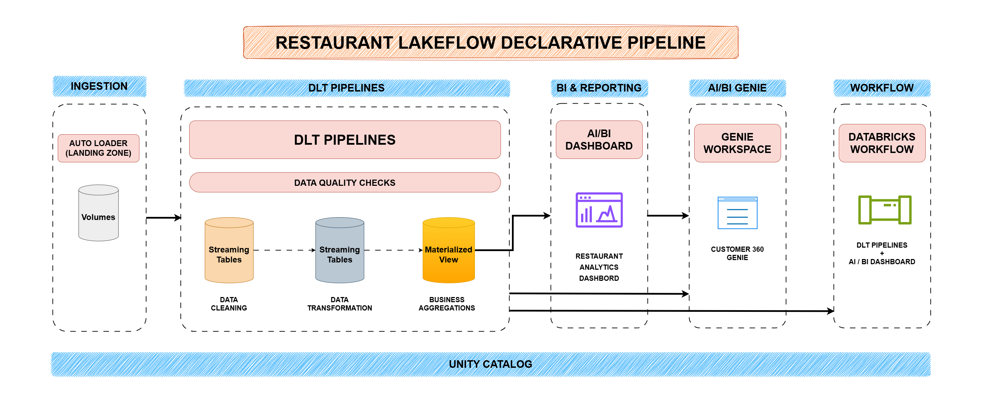
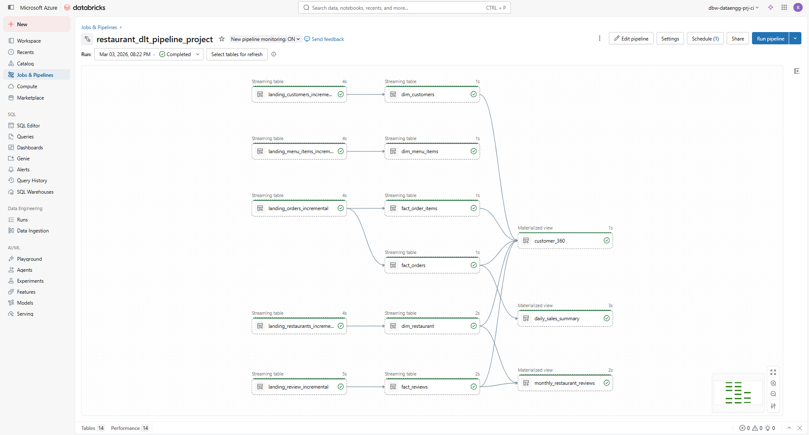
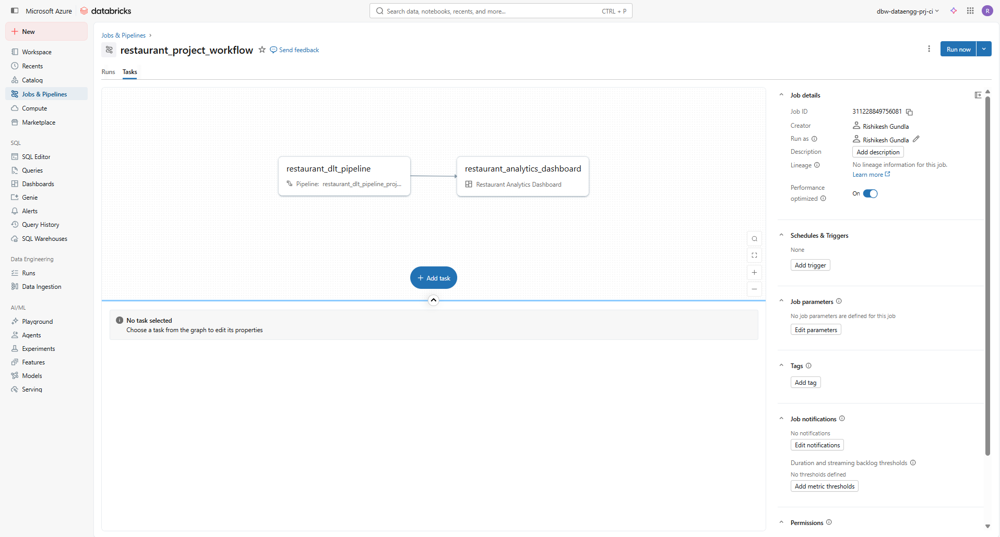
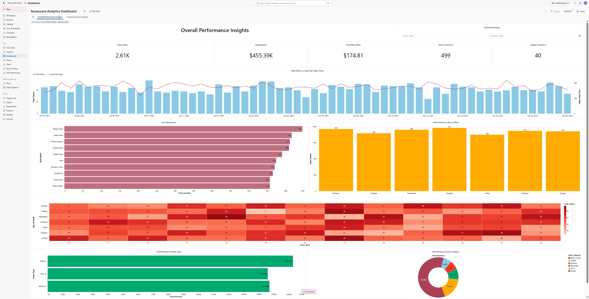
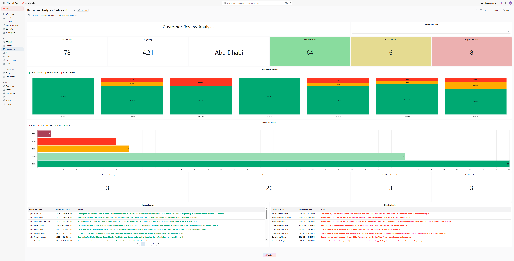
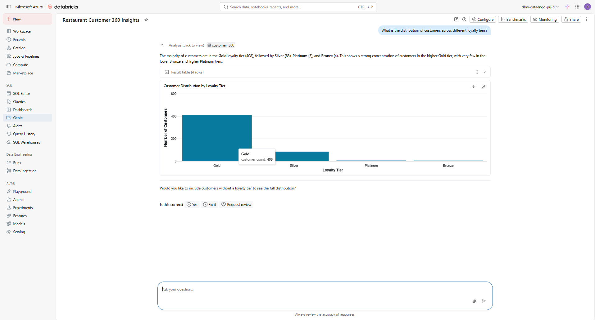

# 🍴 Databricks LakeFlow Declarative Pipelines — Restaurant Analytics Project

This repository showcases a complete **end-to-end Restaurant Analytics pipeline** built using **Databricks LakeFlow Declarative Pipelines (DLT)** and **Workflows**, following the modern Lakehouse Medallion Architecture.

The project demonstrates how to design a **reliable, declarative, AI-enhanced, and production-ready ETL pipeline** that ingests restaurant orders, menu metadata, and customer feedback, processes it using DLT, enriches reviews with **Mosaic AI-powered sentiment intelligence**, and powers AI-driven BI dashboards through Gold-layer materialized views.

---

## 🏗️ LakeFlow Architecture

This architecture outlines the full data lifecycle:

* **Auto Loader Ingestion**: Scalable landing zone for incremental data arrival.
* **DLT Pipeline**: Automated handling of Bronze → Silver → Gold transformations.
* **Data Quality Enforcement**: Built-in governance through **DLT Expectations**.
* **AI-Powered Sentiment Intelligence**: Customer reviews enriched using **Databricks Mosaic AI**.
* **Business Aggregations**: Real-time KPI generation for restaurant performance.
* **Customer 360 Genie Workspace**: Interactive, AI-powered natural language insights.
* **Unified Governance**: Managed via **Unity Catalog**.



---

## 🚀 Project Overview

This project simulates a high-velocity restaurant data engineering workflow using:

* **Streaming Ingestion**: Order transactions and menu master data.
* **Cleansing & Validation**: Expectations (e.g., non-null order IDs, valid price ranges).
* **Feature Engineering**: Derived attributes (order value, peak hour flags, prep time metrics).
* **AI-Powered Sentiment Analysis (Mosaic AI)**:

  * Automated classification of reviews into **Positive / Neutral / Negative**.
  * AI-driven detection of recurring issues such as delivery delays, food quality, and portion size.
  * Enrichment of Silver-layer review datasets with sentiment labels.
* **Intelligent Reporting**: Business layer via **Materialized Views**.
* **Automated Orchestration**: Production scheduling through **Workflows**.
* **Interactive Analytics**: Databricks AI/BI Dashboard & **Genie Workspace** for prompt-based insights.

---

## 🧰 Tech Stack

| Layer             | Technology                                |
| ----------------- | ----------------------------------------- |
| **Ingestion**     | Databricks Auto Loader                    |
| **Processing**    | LakeFlow — Delta Live Tables (DLT)        |
| **Storage**       | Databricks Volumes / Delta Lake           |
| **Governance**    | Unity Catalog                             |
| **Orchestration** | Databricks Workflows                      |
| **BI Reporting**  | Databricks AI/BI Dashboard                |
| **AI Insights**   | Databricks Genie (Natural Language)       |
| **AI/ML Layer**   | Databricks Mosaic AI (Sentiment Analysis) |

---

## 🗂️ Dataset Description

The project uses a synthetic restaurant dataset structured as follows:

* **Customers**: Demographic information, loyalty status, and historical engagement.
* **Menu Items**: Offerings, categories, and pricing structures for historical tracking.
* **Orders**: Transaction-level data including IDs, timestamps, quantities, and totals.
* **Restaurants**: Location metadata, including addresses and operational capacities.
* **Reviews**: Feedback and star ratings for sentiment analysis and quality metrics.

Files are incrementally ingested using **Auto Loader** and processed through the DLT pipeline.

[Get the Project Datasets](./datasets/)

---

## 🪜 Lakehouse Medallion Architecture (Streaming + MVs + AI)

### 🥉 Bronze — *Streaming Table*

* Ingested via Auto Loader (`cloudFiles`).
* Continuous streaming updates from raw CSV landing zones.
* Expectations applied on-the-fly to ensure raw data integrity.

### 🥈 Silver — *Streaming Table + AI Enrichment*

* Live transformations (tax calculations, category joins, order value derivation).
* Review dataset enriched using **Mosaic AI sentiment classification**.
* Built on top of continuous Bronze output.

### 🥇 Gold — *Materialized Views (MV)*

* Pre-aggregated restaurant KPIs (Revenue, AOV, Peak Hours).
* Sentiment analytics dashboards powered by AI-enriched review data.
* Optimized for BI dashboards and Genie AI consumption.
* Automatically refreshed as upstream Streaming Tables update.

---

> ⭐ **Pipeline Design Summary**
>
> * **Landing = Streaming Table (Auto Loader)**
> * **Bronze = Streaming Table**
> * **Silver = Streaming Table + Mosaic AI Enrichment**
> * **Gold = Materialized Views (MV)**
>
> This ensures your pipeline is **fully incremental, AI-enhanced, and production-ready** from raw ingestion to business reporting.

---

## 🔄 DLT Pipeline Lineage

Here is the exact pipeline executed on Databricks:

The lineage shows:

* **Incremental streaming ingestion** - **Bronze → Silver → Gold** - **Materialized views powering dashboards**



---

## ⚙️ Workflow Automation

End-to-end orchestration is implemented using **Databricks Workflows**:

The workflow ensures:

1. **DLT pipeline refresh** 2. **Dashboard auto-refresh** This creates a production-style continuous data pipeline for restaurant operations.




---

## 📊 Restaurant Analytics Dashboard

The final business intelligence layer is powered by a multi-dimensional **Databricks AI/BI Dashboard**.

### 🏢 Executive Performance Summary

* Real-time Financial KPIs: **Total Revenue**, **Total Orders**, **Average Order Value (AOV)**.
* Time-series sales trends and growth analysis.
* Product mix and category contribution insights.
* Peak-hour heatmap for operational optimization.



---

### 💬 Customer Sentiment & Review Intelligence (Powered by Mosaic AI)

This section bridges structured analytics with unstructured AI intelligence:

* **AI-Driven Sentiment Segmentation**: Reviews automatically classified into Positive, Neutral, and Negative using Mosaic AI foundation models.
* **Theme & Issue Detection**: AI identifies recurring pain points such as "Portion Size," "Delivery Time," and "Food Quality."
* **Geographic Rating Analysis**: Regional performance comparison.
* **Review Distribution**: Statistical breakdown of 1–5 star ratings.
* **Live Feedback Monitoring**: Recent review tracking for operational follow-up.

This enables restaurant leadership to move beyond revenue dashboards and understand the *voice of the customer* in real time.



---

## 🧞 Databricks Genie: Customer 360

Databricks Genie provides a **Conversational AI Workspace**, allowing users to generate prompt-based insights without writing SQL.

Users can ask questions like:

* "What were peak revenue hours last week?"
* "Which menu category drives the highest AOV?"
* "What are the most common negative review themes?"

Genie translates natural language into SQL queries on Gold-layer materialized views.



---

## 📁 Repository Structure

```text
restaurant-databricks-declarative-pipeline-project/
│
├── assets/                                    # Architecture, pipeline & dashboard screenshots
│   ├── customer_360_genie_space.png           # Genie workspace visualization
│   ├── customer_review_analysis_dashboard.png # Review sentiment dashboard
│   ├── overall_performance_insights_dashboard.png # Executive summary dashboard
│   ├── restaurant_dlt_architecture.png        # Medallion architecture diagram
│   ├── restaurant_dlt_pipeline_project.png    # DLT pipeline lineage view
│   └── restaurant_project_workflow.png        # Workflow orchestration diagram
│
├── datasets/                                  # Synthetic restaurant source data
│   ├── customers/                             # Demographic & loyalty data
│   ├── menu_items/                            # Item categories & pricing
│   ├── orders/                                # Transactional order records
│   ├── restaurants/                           # Location & capacity metadata
│   └── reviews/                               # Customer feedback & ratings
│
├── notebooks/                                 # Databricks declarative pipeline logic
│   ├── 01_bronze_layer.py                     # Auto Loader ingestion & expectations
│   ├── 02_silver_layer.py                     # Core transformations (Orders/Menu)
│   ├── 02_silver_layer_fact_reviews_sql.sql   # SQL-based review enrichment
│   └── 03_gold_layer.py                       # Materialized views & business KPIs
│
└── README.md                                  # Project documentation

```
